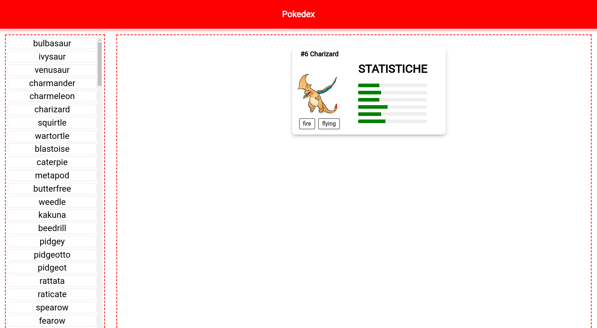

# Demo  
> @author: esorzana

## Introduction
Moduele federeation is a transport code layer, is a webpack-specific (webpack@>=5) technique for sharing build-time modules. It's a way to serve microfrontends code, library, module, components configuration files etc. There are two main part the host, that consume the code and the remote that expose the code.
For a fair comparation single-spa is a way of structuring your routes for microfrontends. Therefore they are not an alternative to each other, but two technologies that can be used in combination.

This is an microfrontend demo using angular and module federation for loading the microfrontends like a web components in shell app.

Basic function: the shell app load mfe1 (list on the left) and mfe2 (info view on the right).
Mfe1 tells mfe2 which pokemon should be displayed.


Below the whole procedure to generate the project from scratch; if you want information on how to deploy this project, go to the [*Development server*](#development-server) section.


## Init Project
This project was generated with [Angular CLI](https://github.com/angular/angular-cli) version 14.0.1 with the following commands:

> Note:
>  - used V.14.0  cause not understood if this configuration dont work on Angluar  V.15.0. **!to be explored**

- `ng new demo --create-application=false`
- `ng generate application mfe1`
- `ng generate application mfe2`
- `ng generate application shell`

## Install dependences
>Note 
> - `x.x.x`: In general same versioning as angular (^14.0.0 in this particular case) 
> - See the package.json file for the best information:

- `npm install @angular-architects/module-federation@x.x.x --DEV`
- `npm install @angular-architects/module-federation-runtime@x.x.x --DEV`
- `npm install @angular-architects/module-federation-tools@x.x.x --DEV`

## Setup Webpack Module Federation
The following commands generates webpack.config.js file in the project target application folder and setup remotes and entry for module federation load, also setup angular.json file for serve and build configuration with webpack.

- `ng add @angular-architects/module-federation --project shell --type host --port 4200`
- `ng add @angular-architects/module-federation --project mfe1 --type remote --port 4201`
- `ng add @angular-architects/module-federation --project mfe2 --type remote --port 4202`


## See Webpack.config.js of shell
This file contain the entry configuration for the app (shell in this case). In this use case all remote entry are configured run time, no one loaded statically. 
>Note: 
> - Commented a static load case example.
> -  A static load can be done before bootstrap application, see project/shell/src/main.ts
> - remoteEntry.js is the main expose file of remote application
>- The shared field is used for declare all shared library used by the app; **!to be explored**

```javascript
const { shareAll, withModuleFederationPlugin } =  require('@angular-architects/module-federation/webpack');

module.exports  =  withModuleFederationPlugin({
//remotes: {mfe1:  "http://localhost:4201/remoteEntry.js"}
shared: {
		
		//"core": { singleton: true, requiredVersion: '0.0.1' },
		...shareAll({ singleton: true, strictVersion: true, requiredVersion: 'auto' 	}),
},
});
```

## See Webpack.config.js of mfe1 and mfe2
The app is exported with a ModuleFederationPlugin containing all configuration.
The exposes field point to the file where the mfe1 app were bootstrapped we'll see the file later, the name can be set as desired, of course it is invoked according to that. 

>Note: 
>- the path of expose file is relative to main project folder not its folder, **!to be explored**
> - the webpack.config.js of mfe2 is the same as follow, change only the name in the fields.

```javascript
const { shareAll, withModuleFederationPlugin } =  require('@angular-architects/module-federation/webpack');

const  ModuleFederationPlugin  =  require("webpack/lib/container/ModuleFederationPlugin");
 
module.exports  = {
	output: {
		publicPath: "auto",
		uniqueName: "mfe1",
		scriptType: 'text/javascript'
	},
	optimization: {
		runtimeChunk: false // Only needed to bypass a temporary bug
	},
	plugins: [
		new  ModuleFederationPlugin({
			name: "mfe1",
			//library: { type: "var", name: "angularf" },
			filename: "remoteEntry.js",
			exposes: {
				'./web-components': './projects/mfe1/src/bootstrap.ts',
			},
			shared: {
			...shareAll({ singleton: true, strictVersion: true, requiredVersion: 'auto' }),
			}
		})
	],
};
```
## Bootstrap files
Use bootstrap Module federation tool for bootstrap AppModule.
```javascript
//projects/shell/src/app/bootstrap.ts
import { bootstrap } from  '@angular-architects/module-federation-tools';
import { AppModule } from  './app/app.module';
import { environment } from  './environments/environment.prod';
bootstrap(AppModule, {
	production: environment.production,
	appType: 'shell'
});
```
> Note:
>  - This file is called by main.ts  in the same folder
> - bootstrap.ts file of mfe1 and mfe2 are in the same relative path, change the *appType* field value (appType: 'microfrontend')
## Export AppModule like a Web Component
Modify app.module.ts of remote app for serve its like a web components using custom elements of angular. 

>Note:
> - createCustomElement aren't in a default angular package, need to install @angular/elements via npm
> - mfe2 file is the same, change name in define customElements function
> - The shell app load its using WebComponentWrapper of Module Federation tool. See [*Next Section*](#use-mfe1-and-mfe2-in-shell-app-like-a-web-component)

```javascript
//projects/mfe1/src/app/app.module.ts
import { HttpClientModule } from  '@angular/common/http';
import { Injector, NgModule } from  '@angular/core';
import { createCustomElement } from  '@angular/elements';
import { BrowserModule } from  '@angular/platform-browser';
import { RouterModule } from  '@angular/router';
import { routes } from  './app-routing.module';
import { AppComponent } from  './app.component';
@NgModule({
	declarations: [
		AppComponent
	],
	imports: [
		BrowserModule,
		HttpClientModule,
		RouterModule.forChild(routes)
	],
	providers: [],
	bootstrap: []
})
export  class  AppModule {
	constructor(private  injector: Injector) {
	}
	ngDoBootstrap() {
		const  ce  =  createCustomElement(AppComponent, { injector: this.injector });
		customElements.define('mfe1-element', ce);
	}
}
```

## Use Mfe1 and Mfe2 in Shell app like a Web Component
Snippet code for use load mfe1 in *app.component.html* like a component, the option are declarated in *app.component.ts* file.
```
<mft-wc-wrapper  [options]="options"></mft-wc-wrapper>
```
```
options: WebComponentWrapperOptions  = {
	remoteEntry: 'http://localhost:4201/remoteEntry.js',
	remoteName: 'mfe1',
	exposedModule: './web-components',
	elementName: 'mfe1-element'
}
```
> Note:
> - the options configuration recall webpack.config.js of mfe1 app; and *remoteEntry.js* are exposed in the same port where mfe1 is served.

## Communication between microfronted remote app
In this case is used a simple Pub-Sub Pattern using windows custom event, the service is located in */project/core/lib/core.service.ts*.
> Note:
> - I tried to implement a pub/sub custom service, but I had problems using share library, all mfe import its service and don't share it. So the service subscriptions are not shared and different mfe can't see subscription of others. **!to be explored**

```javascript
//projects/core/lib/core.service.ts
functionMapper  =  new  Map();
register  = (type: any, fn: any, context:any) => {
	const  id  =  `${type}__${Date.now()}__${Math.floor(Math.random() *  1000)}`;
	this.functionMapper.set(id, { type, fn });
	console.log(context.pokeDB);
	let  c  =  context;
	window.addEventListener(type, (event) =>  fn(event, context));
	return  this.unregister.bind(this, id);
};
	unregister  = (id: string) => {
	if (this.functionMapper.has(id)) {
		const { type, fn } =  this.functionMapper.get(id);
		window.removeEventListener(type, fn);
		this.functionMapper.delete(id);
	}
};
emit  = (type: any, detail: any) => {
	window.dispatchEvent(new  CustomEvent(type, { detail }));
};
unregisterAll  = () => {
	for (let [id, data] of  this.functionMapper) {
		if (filter(data)) {
			window.removeEventListener(data.type, data.fn);
			this.functionMapper.delete(id);
		}
	}
}
```

## Development server

Run serve for mfe1 and mfe2 before serve shell app.
```
ng serve mfe1
```
```
ng serve mfe2
```
```
ng serve shell -o
```
## Future developments
Build remote app and serve its like a microservice using node.js.


## Usefull links

Videos that can give an overview of module federation: 
- https://www.youtube.com/watch?v=D3XYAx30CNc&ab_channel=JackHerrington
- https://www.youtube.com/watch?v=wxnwPLLIJCY&ab_channel=JackHerrington
- https://www.youtube.com/watch?v=EzJF0IUoYhQ&ab_channel=JackHerrington

Angular example of search app expose carousel component to home app:
- https://github.com/jherr/ang-pokemon-mfe

Angular example of lazy load module in routing:
- https://levelup.gitconnected.com/your-first-angular-microfrontend-58950768a465

Angular example of using manifest to load all remote and generate routes:
- https://ng-journal.com/blog/2022-11-06-dynamic-angular-microfrontends/

<<<<<<< HEAD:angular/README.md
Here talks about import map and module federation in single-spa:
 -https://single-spa.js.org/docs/recommended-setup/

 https://www.bitovi.com/blog/how-to-build-a-micro-frontend-architecture-with-angular
=======
Here talks about import map vs module federation in single-spa:
 - https://single-spa.js.org/docs/recommended-setup/
>>>>>>> 8a70665ed4f478bdd945c30dd369495588c4c33b:README.md
